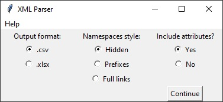

## Introduction
XML Parser is a tool for transforming data from one or more .xml files into a tabular format (.csv or .xlsx).

This tool will work with all .xml files, but it is particularly useful when comparing files that are similar to each other in terms of the structure, but different in terms of values.




## Conversion example
Given ex1.xml:
```xml
<?xml version="1.0" encoding="UTF-8"?>
<contact>
   <name style="First Last">Alan Turing</name>
   <birth>
       <country>England</country>
       <year>1912</year>
   </birth>
   <occupation>Mathematician</occupation>
   <occupation>Computer Scientist</occupation>
</contact>
```

and ex2.xml:
```xml
<?xml version="1.0" encoding="UTF-8"?>
<contact>
   <name style="First Last">Katherine Johnson</name>
   <birth>
       <country>United States</country>
   </birth>
   <occupation>Mathematician</occupation>
   <occupation>Physicist</occupation>
</contact>
```

the tool produces the following output:
|               | ex1.xml            | ex2.xml           | Diff  |
|---------------|--------------------|-------------------|-------|
| name          | Alan Turing        | Katherine Johnson | Break |
| name@style    | First Last         | First Last        | Match |
| birth/country | England            | United States     | Break |
| birth/year    | 1912               |                   | Break |
| occupation[1] | Mathematician      | Mathematician     | Match |
| occupation[2] | Computer Scientist | Physicist         | Break |


## Conversion details
The left-most column gets populated with unique x-paths from all analyzed XML files. The subsequent columns contain the values, one column per each file. The last column states whether all values within a row are same ("Match") or at least one is different than the others ("Break").

The tool has a number of settings:
1. Output format: output can be exported to either .csv or .xlsx (Excel) file.
2. Namespaces style:
    - namespaces can be completely ignored (as in the example above),
    - only the namespace prefixes will be used in the output ("cont" in the example above),
    - full links will be used in the output ("http://examplelink.com/contact-us" in the example above).
3. Attributes: can be included (as in the example above) or not (the "name@style" row would not appear in the example above).

The output gets saved in the same location as the location of the tool under the name converter_output.csv (or .xlsx) or, if converter_output.csv already exists, a numerical suffix will be added (e.g. converter_output1.csv, converter_output2.csv etc.).


## Usage as a standalone package
If you don't know which method to choose, go with this one.
This method only works on Windows.
1. Download the .exe file.
2. Double-click on the downloaded .exe file.
3. Windows might ask for your permission to open the application. Grant it.
4. Select options and click "Continue".
5. In the pop-up window select the XML file(s) you want to transform.
6. The script will produce an output file in the same location as the .exe file.


## Usage as a Python script
1. Make sure you have the necessary dependencies installed:
    - Python 3,
    - pandas module ("pip install pandas"),
    - lxml module ("pip install lxml").
2. Download the python files from the src directory. You can do it using your browser or from a command line using git.
3. In your command line go to the location of the downloaded file.
4. Run "python GUI.py".
4. Select options and click "Continue".
5. In the pop-up window select the XML file(s) you want to transform.
6. The script will produce an output file in the same location as the .py files.
